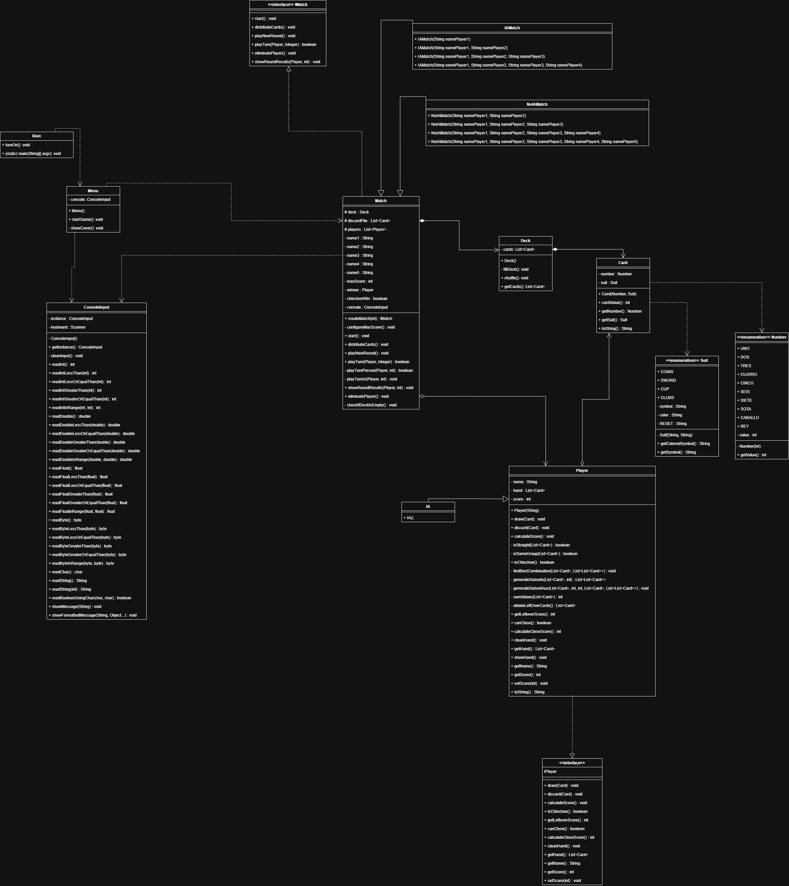
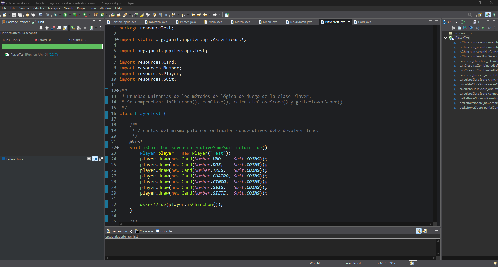

# Práctica Final - Chinchón - Jorge González Burgos - 1ºDAM

## Normas del Juego

El objetivo del juego es ser el jugador con menos puntos al final de la partida, formando combinaciones de cartas o sacar un chinchón.

Se juega con la baraja española, quitando los 8 y 9. Pueden jugar de 2 a 5 personas (también con IA).

Cada jugador empieza con 7 cartas. En su turno puede robar del mazo (boca abajo) o del descarte (boca arriba). Después de robar, descarta una carta de su mano y, si puede, decide si cerrar ronda. Para cerrar, la carta sobrante debe valer 5 o menos. Las combinaciones válidas son:

- **Iguales:** mínimo tres cartas del mismo número.
- **Escalera:** mínimo tres cartas consecutivas del mismo palo (el 7 continúa con el 10, pero el 12 no continúa con el 1).
- **Chinchón:** siete cartas consecutivas del mismo palo — victoria inmediata.

Al cerrar ronda, el resto de jugadores suman a su puntuación el valor de sus cartas no combinadas. El jugador que cierra con 7 cartas combinadas descuenta 10 puntos. El jugador que alcance o supere la puntuación máxima es eliminado. La partida termina cuando solo queda un jugador o alguien saca chinchón.

---

## Estructura del proyecto

El proyecto se divide en dos paquetes:

**`app`** — lógica de partida y entrada por consola

| Clase | Descripción |
|---|---|
| `Main` | Punto de entrada. Crea el `Menu` y arranca la aplicación. |
| `Menu` | Muestra el menú principal en bucle y delega la creación de partida a `Match`. |
| `Match` | Clase base. Contiene la lógica completa del juego: reparto, turnos, resultados, eliminación. Incluye la factoría `createMatch()`. |
| `IAMatch` | Extiende `Match`. Añade automáticamente una `IA` a la lista de jugadores. |
| `NoIAMatch` | Extiende `Match`. Partida solo con jugadores humanos. |
| `IMatch` | Interfaz que define el contrato de una partida: `start`, `distributeCards`, `playNewRound`, `playTurn`, `showRoundResults`, `eliminatePlayer`. |
| `ConsoleInput` | Singleton. Centraliza toda la lectura de datos por consola con validación de entrada para `int`, `double`, `float`, `byte`, `char`, `String` y `boolean`. |

**`resources`** — modelo de datos del juego

| Clase | Descripción |
|---|---|
| `Player` | Representa a un jugador humano. Gestiona la mano, la puntuación y toda la lógica de combinaciones mediante backtracking. |
| `IA` | Extiende `Player`. Nombre fijo "IA"; su turno lo gestiona `Match` de forma automática. |
| `IPlayer` | Interfaz que define el contrato de un jugador: `draw`, `discard`, `canClose`, `calculateCloseScore`, `getLeftoverScore`, etc. |
| `Card` | Representa una carta con su `Number` y su `Suit`. |
| `Deck` | Baraja de 40 cartas (4 palos × 10 números). Se genera en `fillDeck()` y se puede barajar con `shuffle()`. |
| `Number` | Enum con los valores de la baraja española sin 8 ni 9: `UNO`…`SIETE`, `SOTA(10)`, `CABALLO(11)`, `REY(12)`. |
| `Suit` | Enum con los cuatro palos (`COINS`, `SWORD`, `CUP`, `CLUBS`), cada uno con emoji y color ANSI. |

### Diagrama de Clases UML



---

## Flujo de la partida

```
Main.main()
  └─ Menu.startGame()
       └─ Match.createMatch(option)      ← factoría: devuelve IAMatch o NoIAMatch
            └─ IMatch.start()
                 ├─ configureMaxScore()  ← el usuario fija la puntuación límite
                 └─ bucle mientras queden jugadores y no haya chinchón
                      ├─ playNewRound()
                      │    ├─ distributeCards()   ← nueva baraja, reparto de 7 cartas, descarte inicial
                      │    └─ bucle de turnos
                      │         └─ playTurn(player, turn)
                      │              ├─ [humano] playTurnPerson()
                      │              │    ├─ muestra descarte y mano
                      │              │    ├─ roba del mazo o del descarte
                      │              │    ├─ descarta una carta
                      │              │    └─ si turn > 1 y canClose() → ofrece cerrar
                      │              └─ [IA] playTurnIA()
                      │                   ├─ roba siempre del mazo
                      │                   └─ descarta aleatoriamente
                      ├─ si alguien cierra → showRoundResults()
                      │    ├─ puntuación del que cierra (calculateCloseScore)
                      │    │    ├─ Chinchón  → Integer.MIN_VALUE (victoria inmediata)
                      │    │    ├─ 7 combinadas → -10 puntos
                      │    │    └─ 6 combinadas → valor de la carta sobrante
                      │    └─ resto de jugadores → getLeftoverScore() (recursividad)
                      └─ eliminatePlayer()  ← elimina a quien alcanza la puntuación límite
```

#### Lógica de combinaciones (recursividad en `Player`)

El método `findBestCombination()` busca de forma recursiva la combinación en la mano más conveniente, dejando solas las cartas de menor valor. Para cada tamaño posible de subconjunto (de mayor a menor) genera todos los subconjuntos posibles y comprueba si forman una escalera válida (`isStraight`) o un grupo de iguales válido (`isSameGroup`). Cuando encuentra una combinación válida, retira esas cartas y recursa con el resto. El resultado final son las cartas sobrantes de menor valor posible.

---

## Pruebas Unitarias

Las pruebas están implementadas en `PlayerTest.java` y comprueban los métodos `isChinchon()`, `canClose()`, `calculateCloseScore()` y `getLeftoverScore()` de la clase `Player`.

### Enfoque: caja negra con apoyo de caja blanca

Las pruebas se han diseñado principalmente con **enfoque de caja negra**, ya que cada caso de prueba se ha elegido a partir del comportamiento esperado del método, no de cómo está implementado internamente:

- Se han identificado las distintas situaciones posibles: chinchón, combinación parcial, sin combinaciones, sobrante válido, sobrante inválido…
- Se han cubierto los **valores límite** clave: el umbral de valor 5 para el sobrante (`canClose`), los 7 valores consecutivos exactos (`isChinchon`), y la diferencia entre devolver `-10` y devolver el valor de la sobrante (`calculateCloseScore`).
- Se ha comprobado también el **camino de error**, verificando que `calculateCloseScore` lanza `IllegalStateException` cuando el jugador no puede cerrar.

Sin embargo, el conocimiento del código interno ha sido útil como **apoyo de caja blanca** en dos aspectos concretos:

- Saber que `isChinchon()` ordena las cartas por **ordinal del enum** (no por valor numérico) ha permitido diseñar el caso `SEIS → SOTA`, que tiene valores 6 y 10 pero ordinales 5 y 7, dejando un hueco que rompe la escalera. Sin conocer ese detalle interno, ese caso límite sería difícil de identificar solo con caja negra.
- Saber que `calculateCloseScore()` usa `Integer.MIN_VALUE` como señal interna de chinchón ha permitido verificar ese valor concreto en lugar de limitarse a comprobar que no lanza excepción.

En resumen, el diseño de los casos es de **caja negra** (qué debe hacer el método), pero el conocimiento del código ha refinado algunos casos límite que de otro modo podrían haberse pasado por alto.

### Capturas de las pruebas

